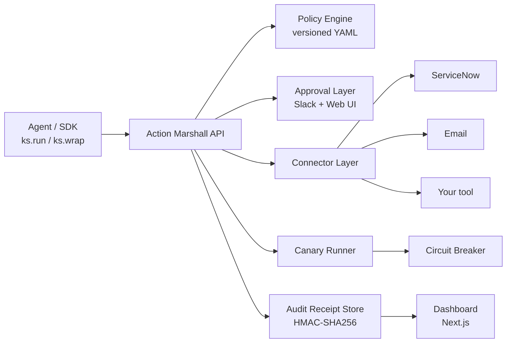

# Action Marshall

> **Action-level release control for AI agents.**
> Preview, approve, canary, halt, and audit AI agent actions before they touch production systems — ServiceNow, Jira, Salesforce, email, databases, internal tools.

[](https://github.com/SatwikReddySripathi/action-marshall/actions/workflows/backend-ci.yml)
[](https://github.com/SatwikReddySripathi/action-marshall/actions/workflows/ui-ci.yml)
[](https://pypi.org/project/action-marshall/)
[](LICENSE)
[](https://www.python.org/downloads/)
[](#project-status)

---

## What is this?

IAM answers: *Can this agent access this tool?*
Action Marshall answers: *Should this specific action be released right now?*

You wrap the tools your agent already calls. Action Marshall sits in front of them and runs six checks before the action ships:

```
Agent action
  → Preview diff and blast radius
  → Evaluate policy
  → Require approval if needed
  → Canary on small batch
  → Monitor invariants
  → Expand or halt
  → Generate signed audit receipt
```

```python
from action_marshall import MarshallClient

ks = MarshallClient(api_key="am_...", base_url="http://localhost:8000")

protected_tool = ks.wrap(existing_tool)   # ← that's it
```

If the action is safe (`AUTO`) it runs immediately. If it needs review (`APPROVAL_REQUIRED`) it pauses for a human in Slack or the dashboard. If it's dangerous (`BLOCK`) it never runs. If a canary uncovers a problem the circuit breaker halts before damage spreads. Every action gets an HMAC-signed receipt — the audit log is tamper-evident.

---

## Quickstart — 5 minutes to a working setup

You need two things running: the **backend** (Docker, ~3 min) and the **SDK** (`pip install`, ~30 sec). Then call it from any Python script.

### 1. Start the backend

```bash
git clone https://github.com/SatwikReddySripathi/action-marshall.git
cd action-marshall
docker compose up --build
```

Two services come up:
- `backend` on `http://localhost:8000` (FastAPI + SQLite, signed-receipt + policy engine)
- `ui` on `http://localhost:3000` (Next.js approval dashboard)

Wait until you see `Application startup complete`. Smoke check: `curl http://localhost:8000/ready` should return `200`.

### 2. Install the SDK

```bash
pip install action-marshall
```

### 3. Send your first governed action

```python
from action_marshall import MarshallClient, Action, ActionParams

ks = MarshallClient(
    api_key="am_test_demo_key_001",
    base_url="http://localhost:8000",
)

result = ks.run(Action(
    tool="servicenow",
    action_type="bulk_update",
    params=ActionParams(
        connector="servicenow_sim",
        query={"state": "open", "priority": {"op": "in", "value": ["P3", "P4"]}},
        changes={"state": "in_progress"},
    ),
))

print(result.decision_value)   # AUTO | CANARY | BLOCK | APPROVAL_REQUIRED
print(result.status)            # completed | contained | blocked | awaiting_approval | observed
print(result.proof_url)         # /v1/actions/<id>/proof
```

Open `result.ui_urls["detail"]` in your browser to see the preview, policy decision, canary, post-execution checks, and signed receipt — the whole lifecycle for that action.

---

## Wrap the tools your agent already calls

The killer pattern. Decorate any function that hits a production system and every call becomes a governed action:

```python
@ks.wrap_function(
    tool="servicenow",
    action_type="update_incident",
    connector="servicenow_sim",
    agent_id="incident-triage",
)
def update_incident(payload: dict) -> dict:
    # your existing implementation — no changes needed
    ...

# Every call is now governed.
result = update_incident({"incident_id": "INC001", "status": "resolved"})
```

- Policy says `AUTO` → your function runs normally.
- Policy says `BLOCK` → your function is **not** called, `MarshallDenied` is raised.
- Policy says `APPROVAL_REQUIRED` → your function is **not** called, `MarshallApprovalRequired` is raised. Approve in Slack or the web UI; the next call goes through.

Pass `on_denied=...` / `on_approval_required=...` callbacks if you'd rather handle these without exceptions.

For a dry run that doesn't execute anything:

```python
preview = ks.preview(Action(...))
print(preview.decision_value, preview.blast_radius, preview.preview_hash)
```

To verify a signed receipt offline:

```python
receipt = ks.verify_receipt("act_abc123")
print(receipt.verified)    # True if HMAC matches
```

More SDK details: [sdk/README.md](sdk/README.md).

---

## Works with your existing agent stack

| Framework / pattern                | Status                              |
|------------------------------------|-------------------------------------|
| Plain Python functions             | `available now`                     |
| Custom Python agents               | `available now`                     |
| LangChain (`BaseTool`)             | `available now` *(experimental)*    |
| LangGraph                          | `planned`                           |
| CrewAI                             | `planned`                           |
| AutoGen                            | `planned`                           |
| OpenAI tool / function calling     | `planned`                           |
| MCP tools                          | `planned`                           |
| LlamaIndex                         | `planned`                           |

Optional installs:

```bash
pip install action-marshall                  # base
pip install "action-marshall[langchain]"     # available now (experimental)
pip install "action-marshall[all]"           # everything as it lands
```

LangChain example:

```python
from langchain_core.tools import tool
from action_marshall.adapters.langchain import wrap_langchain_tool

@tool
def update_incident(payload: dict) -> dict: ...

protected = wrap_langchain_tool(
    update_incident, ks=ks,
    tool="servicenow", action_type="update_incident",
    connector="servicenow_sim", agent_id="incident-triage",
)
# protected.invoke({...}) is now governed.
```

---

## Architecture



The UI and SDK talk to the same backend. Every action carries through the same six stages and lands in the receipt store.

---

## Self-host or hosted

**Self-host today** — `docker compose up` runs the whole control plane on your machine. The compose file ships safe local defaults; copy `.env.example` to `.env` to customize.

**Join the hosted waitlist** if you'd rather not operate the backend yourself. Hosted Action Marshall runs the control plane for you; you connect through the SDK with an API key. Migration from self-host is a one-line `base_url` change.

[**Join the hosted waitlist →**](#)  *(link coming — hosted Action Marshall is not live yet)*

Detail: [docs/self-hosting.md](docs/self-hosting.md) · [docs/hosted.md](docs/hosted.md) · [docs/deployment.md](docs/deployment.md)

---

## Documentation

| Doc | What it covers |
|---|---|
| [docs/self-hosting.md](docs/self-hosting.md) | Docker Compose setup, env vars, persistent volumes, Slack setup, HTTPS, upgrades, common issues |
| [docs/deployment.md](docs/deployment.md) | Production hardening: TLS, secrets, sizing, backups, monitoring, capacity thresholds |
| [docs/hosted.md](docs/hosted.md) | Self-hosted vs hosted comparison, what hosted will/won't do, design-partner program |
| [docs/cli.md](docs/cli.md) | `action-marshall` CLI: `init`, `preview`, `run`, `receipts list`, `receipts verify` |
| [docs/security.md](docs/security.md) | Threat model, per-stage controls, crypto inventory, known weaknesses, self-host checklist |
| [docs/release.md](docs/release.md) | One-time PyPI Trusted Publisher setup + rollback procedure |
| [docs/repo-audit.md](docs/repo-audit.md) | P0/P1/P2 task list and gap analysis |
| [SECURITY.md](SECURITY.md) | Vulnerability disclosure path |
| [CONTRIBUTING.md](CONTRIBUTING.md) | Dev setup, conventional commits, test commands |
| [CHANGELOG.md](CHANGELOG.md) | Release notes |
| [RELEASE.md](RELEASE.md) | One-page release checklist |

---

## Project status

Action Marshall is **alpha**. The core pipeline — preview, policy, approval, canary, circuit breaker, proof — is implemented and exercised by tests end-to-end. APIs may change before `1.0.0`.

**Available now**

- Full 6-stage action lifecycle (preview → policy → approval → canary → breaker → signed proof)
- `MarshallClient` SDK with `run`, `preview`, `wrap`, `wrap_function`, `wrap_tool`, `verify_receipt`
- `action-marshall` CLI (`init`, `preview`, `run`, `receipts list`, `receipts verify`)
- `/health` (liveness) and `/ready` (DB + signing-key gated) endpoints
- Policy engine with versioned YAML rules and content-hashed decisions
- Slack interactive-message approval flow + employee 2FA (OTP)
- HMAC-SHA256 signed audit receipts bound to preview hash + policy version
- ServiceNow (simulator + real REST API) and generic email connectors
- Next.js dashboard: action list / detail / signed-proof viewer / approvals / agents / audit / policies / workspaces
- Docker Compose self-host (backend + UI) with healthchecks
- Multi-tenant model (org-scoped API keys, workspaces, agent registry, connection registry)
- 57 unit + integration tests across backend (TestClient + script) and SDK

**Experimental**

- LangChain adapter (`action_marshall.adapters.langchain.wrap_langchain_tool`)

**Planned**

- Postgres support + Alembic migrations
- LangGraph, CrewAI, AutoGen, MCP, LlamaIndex, OpenAI tool adapters
- Jira and Salesforce connectors
- Audit export (CSV / JSON)
- argon2id password hashing migration
- Redis-backed rate limiting and approval state (unblocks multi-worker)
- `examples/` folder with per-framework, per-scenario walkthroughs

**Roadmap**

- Hosted Action Marshall (managed service — [join the waitlist](#))
- SSO / SAML
- Teams approvals
- Policy templates library
- Multi-key signing for `PROOF_SECRET` rotation

See [docs/repo-audit.md](docs/repo-audit.md) for the full P0 / P1 / P2 breakdown.

---

## Reference

Most operators won't need these on day one — read the docs links above first. These are the "how does the inside work" parts of the system.

### Adding a connector

Action Marshall is tool-agnostic. Implement four methods to add any system:

```python
# backend/app/connectors/my_tool.py
from app.connectors.base import BaseConnector

class MyToolConnector(BaseConnector):
    def query(self, filters: dict) -> list[dict]: ...
    def compute_diffs(self, records: list[dict], changes: dict) -> list[dict]: ...
    def execute_update(self, sys_ids: list[str], changes: dict, metadata=None) -> list[dict]: ...
    def get_record(self, sys_id: str) -> dict | None: ...
```

Register it in `backend/app/routes/actions.py`:

```python
CONNECTORS = {
    "servicenow_sim":  get_snow,
    "my_tool":         lambda: MyToolConnector(),   # ← add this
}
```

Preview, policy, canary, breaker, approval, and proof all work without further changes.

### Policy engine

Policies are versioned YAML files in `backend/app/policies/`. Each rule produces a structured decision; the engine takes the strictest match. Decision hierarchy: `BLOCK > APPROVAL_REQUIRED > CANARY > AUTO`. Multiple matching rules escalate, never de-escalate. See `backend/app/policies/default_policy.yaml` for the shipped default.

### Audit receipts

Every action (completed or halted) gets a signed JSON receipt covering the full lifecycle: who proposed it, what was previewed, what policy decided, who approved, what executed, breaker state, full event timeline. Signed with HMAC-SHA256 over canonical-JSON, verifiable offline. Full receipt format and offline-verify recipe: [docs/security.md](docs/security.md).

### Why not just log everything?

Logging records *what happened*. Action Marshall governs *what is allowed to happen* — before it happens.

|                       | Logging / observability             | Action Marshall                                         |
|-----------------------|--------------------------------------|---------------------------------------------------------|
| Timing                | After execution                      | Before + during                                         |
| Blast radius          | Reconstructed from logs              | Computed pre-execution                                  |
| Human approval        | Out-of-band (email / ticket)         | Built-in, cryptographically bound to receipt            |
| Partial execution     | Hard to detect                       | Circuit breaker halts mid-execution                     |
| Audit trail           | Log files                            | Signed, tamper-evident receipt per action               |

---

## Contributing

Issues, pull requests, connectors, and framework adapters welcome. See [CONTRIBUTING.md](CONTRIBUTING.md) for setup and conventional-commit guidance.

```bash
# Backend pytest suite (TestClient-based, no server needed)
cd backend && python -m pytest

# SDK pytest suite
cd sdk && python -m pytest

# UI smoke
cd ui && npm ci && npm run lint && npx tsc --noEmit && npm run build
```

Security disclosures: [SECURITY.md](SECURITY.md). Community guidelines: [CODE_OF_CONDUCT.md](CODE_OF_CONDUCT.md).

---

## License

[MIT](LICENSE).
