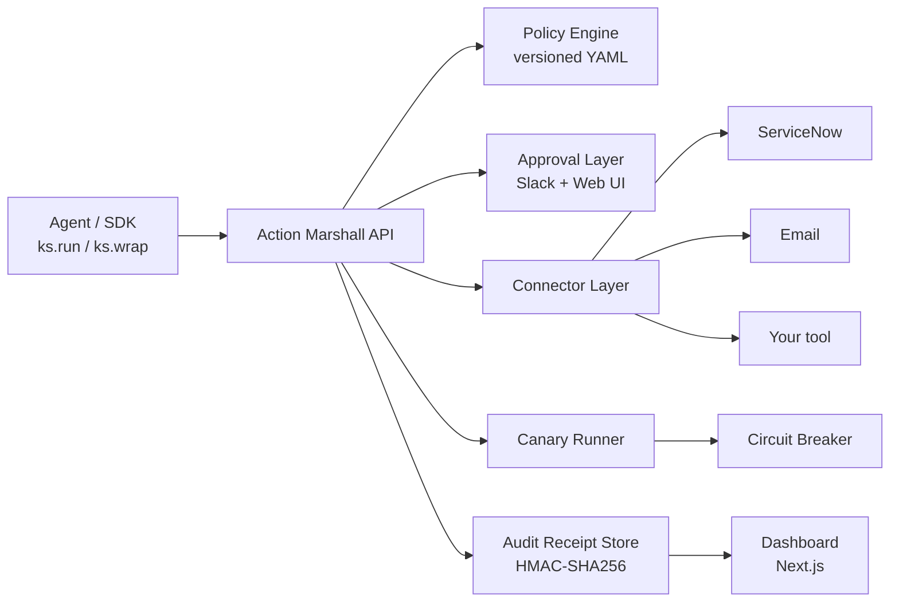

# Action Marshall

> **Action-level release control for AI agents.**
>
> Action Marshall lets teams preview, approve, canary, halt, and audit AI agent actions before they touch production systems such as ServiceNow, Jira, Salesforce, email, databases, or any internal tool.

[](https://github.com/SatwikReddySripathi/action_marshall/actions/workflows/backend-ci.yml)
[](https://github.com/SatwikReddySripathi/action_marshall/actions/workflows/ui-ci.yml)
[](LICENSE)
[](https://www.python.org/downloads/)
[](#project-status)

---

## The problem

AI agents are starting to operate across tools like ServiceNow, Jira, Salesforce, email, databases, and internal systems.

**IAM answers:** *Can this agent access this tool?*

**Action Marshall answers:** *Should this specific action be released right now?*

- What will change?
- How far can it run?
- Who approved it?
- What evidence exists afterward?
- Can we stop it before it causes damage?

Action Marshall is **not** a replacement for IAM, observability, guardrails, or your agent framework — it sits next to them.

| Layer            | Answers                                  |
|------------------|------------------------------------------|
| IAM              | *Can the agent access this tool?*        |
| Observability    | *What did the agent do?*                 |
| Guardrails       | *What should the model say?*             |
| **Action Marshall**     | *Should this specific action be release?*   |

---

## Core workflow

```
Agent action
  → Preview diff and blast radius
  → Evaluate policy
  → Require approval if needed
  → Canary on small batch
  → Monitor invariants
  → Expand or halt
  → Generate signed audit receipt
```

Six stages run automatically on every governed call:

| Stage              | What it does                                                                                            |
|--------------------|---------------------------------------------------------------------------------------------------------|
| **Preview**        | Queries affected records, computes diffs, measures blast radius, generates a content hash.              |
| **Policy**         | Evaluates versioned YAML rules → `AUTO` / `CANARY` / `APPROVAL_REQUIRED` / `BLOCK`.                     |
| **Approval gate**  | If required, pauses and notifies via Slack or web UI. Only verified employees can approve.              |
| **Canary**         | Executes on a deterministic 5-record subset first. Re-checks before expanding.                          |
| **Circuit breaker**| If canary reveals unexpected side-effects, unauthorized field changes, or error spikes — halts.         |
| **Proof**          | HMAC-SHA256 signed receipt covering the full lifecycle: who proposed, what was previewed, what shipped. |

---

## Works with your existing agent stack

**You do not have to rewrite your agent.**

Wrap the tools or functions your agent already calls. Action Marshall handles preview, policy, approval, canary, breaker, and signed audit before the action runs.

```python
from action_marshall import MarshallClient

ks = MarshallClient(api_key="ks_...", base_url="http://localhost:8000")

protected_tool = ks.wrap(existing_tool)
```

| Framework / pattern              | Status                                |
|----------------------------------|---------------------------------------|
| Plain Python functions           | `available now`                       |
| Custom Python agents             | `available now`                       |
| LangChain (`BaseTool`)           | `available now` *(experimental)*      |
| LangGraph                        | `planned`                             |
| CrewAI                           | `planned`                             |
| AutoGen                          | `planned`                             |
| OpenAI tool / function calling   | `planned`                             |
| MCP tools                        | `planned`                             |
| LlamaIndex                       | `planned`                             |

Optional installs per framework:

```bash
pip install action-marshall                  # base
pip install "action-marshall[langchain]"     # available now (experimental)
pip install "action-marshall[langgraph]"     # planned
pip install "action-marshall[crewai]"        # planned
pip install "action-marshall[autogen]"       # planned
pip install "action-marshall[mcp]"           # planned
pip install "action-marshall[llamaindex]"    # planned
pip install "action-marshall[openai]"        # planned
pip install "action-marshall[all]"
```

> **Note**: `action-marshall` is not yet published to PyPI. Until the first release lands, install from source: `pip install -e ./sdk`. Tracking this in the [roadmap](#roadmap).

---

## Quickstart

**Prerequisites:** Python 3.11+, Node.js 20+.

```bash
git clone https://github.com/SatwikReddySripathi/action_marshall
cd action_marshall
```

### Run the backend

```bash
cd backend
python -m venv .venv
source .venv/bin/activate         # Windows: .venv\Scripts\activate
pip install -r requirements.txt
cp .env.example .env              # then edit values
python -m uvicorn app.main:app --reload --port 8000
```

API listens on `http://localhost:8000`. Health: `GET /health`.

### Run the UI (new terminal)

```bash
cd ui
cp .env.example .env.local
npm ci
npm run dev
```

Dashboard: [http://localhost:3000](http://localhost:3000).

### Install the SDK (new terminal)

```bash
cd sdk
pip install -e ".[dev]"
```

### Send your first governed action

```python
from action_marshall import MarshallClient, Action, ActionParams

ks = MarshallClient(api_key="am_test_demo_key_001",
                    base_url="http://localhost:8000")

result = ks.run(Action(
    tool="servicenow",
    action_type="bulk_update",
    params=ActionParams(
        connector="servicenow_sim",
        query={"state": "open", "priority": {"op": "in", "value": ["P3", "P4"]}},
        changes={"state": "in_progress"},
    ),
))

print(result.decision_value)   # AUTO | CANARY | BLOCK | APPROVAL_REQUIRED
print(result.status)           # completed | contained | blocked | awaiting_approval | observed
print(result.proof_url)        # /v1/actions/<id>/proof
```

Open the action in the dashboard at `result.ui_urls["detail"]` to see the preview, decision, canary, checks, and signed receipt.

---

## SDK usage

### Wrap an existing function

```python
@ks.wrap_function(
    tool="servicenow",
    action_type="update_incident",
    connector="servicenow_sim",
    agent_id="incident-triage",
)
def update_incident(payload: dict) -> dict:
    # your existing implementation
    ...

# Each call is governed: policy is evaluated before update_incident runs.
result = update_incident({"incident_id": "INC001", "status": "resolved"})
```

If the policy decides `BLOCK`, `update_incident` is **not** called and a `MarshallDenied` is raised. If it decides `APPROVAL_REQUIRED`, a `MarshallApprovalRequired` is raised. Pass `on_denied=...` / `on_approval_required=...` callbacks to handle these gracefully without exceptions.

### Preview without executing

```python
preview = ks.preview(Action(...))
print(preview.decision_value, preview.blast_radius, preview.preview_hash)
```

### Wrap a LangChain tool *(experimental)*

```python
from langchain_core.tools import tool
from action_marshall.adapters.langchain import wrap_langchain_tool

@tool
def update_incident(payload: dict) -> dict:
    ...

protected = wrap_langchain_tool(
    update_incident,
    ks=ks,
    tool="servicenow",
    action_type="update_incident",
    connector="servicenow_sim",
    agent_id="incident-triage",
)
# protected.invoke({...}) is now governed.
```

### Verify a signed receipt

```python
receipt = ks.verify_receipt("act_abc123")
print(receipt.verified)    # True if the HMAC signature matches
print(receipt.signature)
```

Full SDK docs: [sdk/README.md](sdk/README.md).

---

## Self-hosting

Self-host Action Marshall if you want to run the action control layer inside your own environment.

```bash
docker compose up
```

Two services come up:

- `backend` on `:8000` — FastAPI + SQLite, persistent volume `action-marshall-data`.
- `ui` on `:3000` — Next.js dashboard.

Environment variables to set (see [backend/.env.example](backend/.env.example)):

| Variable              | Purpose                                                                 |
|-----------------------|-------------------------------------------------------------------------|
| `DATABASE_PATH`       | Where to write the sqlite file inside the container.                    |
| `PROOF_SECRET`        | HMAC key for signing audit receipts. **Generate a long random value.**  |
| `DEFAULT_ORG_ID`      | Seed org for first-run.                                                 |
| `DEFAULT_API_KEY`     | Seed API key for first-run.                                             |
| `SLACK_WEBHOOK_URL`   | Optional — enables Slack approval messages.                             |
| `SNOW_INSTANCE` etc.  | Optional — for the live ServiceNow connector.                           |
| `SMTP_*`              | Optional — for employee 2FA OTP delivery.                               |

The backend image runs `gunicorn` with a single uvicorn worker. Rate-limiting and approval state are in-process today, so do not raise the worker count without first moving that state to Redis. Postgres support is `planned`.

More: [docs/self-hosting.md](docs/self-hosting.md) for the 5-minute quickstart, env vars, backup, HTTPS termination, and upgrade steps. Production hardening: [docs/deployment.md](docs/deployment.md).

---

## Want Action Marshall hosted for you?

**Self-host today.** Join the hosted waitlist if you want Action Marshall managed for you.

We run the control layer. You connect your agents through the SDK / API key. Your team gets action previews, approvals, canaries, circuit breakers, and signed audit receipts — without managing infrastructure. Migration from self-host is a one-line `base_url` change.

[**Join the hosted waitlist →**](#)  *(link coming — hosted Action Marshall is not live yet)*

Full hosted vs. self-host comparison, what hosted will and won't do, and the design-partner program: [docs/hosted.md](docs/hosted.md).

---

## Architecture



The UI and SDK talk to the same backend. Every action carries through the same lifecycle and lands in the receipt store.

---

## Adding a connector

Action Marshall is tool-agnostic. Implement four methods to add any system:

```python
# backend/app/connectors/my_tool.py
from app.connectors.base import BaseConnector

class MyToolConnector(BaseConnector):
    def query(self, filters: dict) -> list[dict]:
        ...
    def compute_diffs(self, records: list[dict], changes: dict) -> list[dict]:
        ...
    def execute_update(self, sys_ids: list[str], changes: dict, metadata=None) -> list[dict]:
        ...
    def get_record(self, sys_id: str) -> dict | None:
        ...
```

Register it:

```python
# backend/app/routes/actions.py
CONNECTORS = {
    "servicenow_sim":  get_snow,
    "servicenow_real": get_snow_real,
    "email_generic":   get_email,
    "my_tool":         lambda: MyToolConnector(),   # ← add this
}
```

Preview, policy, canary, breaker, approval, and proof all work without further changes.

---

## Policy engine

Policies are versioned YAML files in `backend/app/policies/`. The engine evaluates rules and takes the strictest matching decision:

```yaml
policy_id: default
version: "1.1.0"
thresholds:
  max_blast_radius: 50
  canary_size: 5
  canary_max_error_rate: 0.0

rules:
  - name: blast_radius_limit
    condition: { field: blast_radius, op: gt, value: 50 }
    decision: BLOCK

  - name: no_p1_incidents
    condition: { flag: has_p1, op: eq, value: true }
    decision: BLOCK

  - name: p2_approval_required
    condition: { flag: has_p2, op: eq, value: true }
    decision: APPROVAL_REQUIRED

  - name: canary_for_medium_blast
    condition: { field: blast_radius, op: gte, value: 10 }
    decision: CANARY

  - name: auto_small_changes
    condition: { field: blast_radius, op: lte, value: 10 }
    decision: AUTO
```

Decision hierarchy: `BLOCK > APPROVAL_REQUIRED > CANARY > AUTO`. Multiple matching rules escalate, never de-escalate.

---

## Audit proof

Every completed (or halted) action emits a signed receipt:

```json
{
  "receipt": {
    "action":   { "action_id": "act_...", "tool": "servicenow", "actor": { "name": "IncidentTriageAgent" } },
    "policy":   { "decision": "CANARY", "version": "1.1.0", "reasons": [] },
    "preview":  { "blast_radius": 20, "preview_hash": "sha256:..." },
    "execution": {
      "phase": "canary",
      "checks": [
        { "check_name": "no_out_of_scope",      "passed": true  },
        { "check_name": "only_intended_fields", "passed": false }
      ],
      "breaker": { "tripped": true, "reason": "only_intended_fields failed" }
    },
    "approvals": [],
    "timeline":  []
  },
  "signature": "hmac-sha256:...",
  "verified":  true
}
```

Receipts are verifiable offline. Verify via the SDK:

```python
ks.verify_receipt("act_...").verified  # True
```

---

## Security model

- **Action Marshall does not replace IAM.** It complements it. IAM controls access; Action Marshall controls whether a specific action is released.
- **Signed audit receipts.** HMAC-SHA256 over the full action lifecycle. Receipts bind to the `preview_hash + policy_version`, which prevents *approve-then-swap-payload* attacks.
- **Approval records.** Stored with approver identity, channel, and the preview hash they approved against.
- **Policy versioning.** Decisions record the exact policy version that produced them.
- **Secrets via environment variables only.** Never in source control. The repo has no committed secrets — see [SECURITY.md](SECURITY.md) for the full disclosure process.
- **API keys.** Stored as SHA-256 hashes, scoped to `org_id`, transported via `X-API-Key`.

Out of scope: model hallucination, identity-provider compromise, malicious infrastructure admins, and bad policies written by the customer.

Full threat model, per-stage controls, crypto inventory, known weaknesses, and a self-host security checklist are in [docs/security.md](docs/security.md). Vulnerability disclosure: [SECURITY.md](SECURITY.md).

---

## Examples

Working examples in this repo (run from `sdk/`):

| Example                       | What it shows                                                       |
|-------------------------------|---------------------------------------------------------------------|
| [demo.py](sdk/demo.py)        | Four end-to-end scenarios: completed, contained, blocked, approval. |
| [demo_3min.py](sdk/demo_3min.py) | A condensed three-minute demo flow.                              |
| [onboarding_example.py](sdk/onboarding_example.py) | Minimal "first action" walkthrough.            |

A dedicated `examples/` folder with per-framework, per-scenario examples (LangChain, LangGraph, MCP, ServiceNow, email) is `planned`.

---

## Why not just log everything?

Logging records *what happened*. Action Marshall governs *what is allowed to happen* — before it happens.

|                       | Logging / observability             | Action Marshall                                                |
|-----------------------|--------------------------------------|---------------------------------------------------------|
| Timing                | After execution                      | Before + during                                         |
| Blast radius          | Reconstructed from logs              | Computed pre-execution                                  |
| Human approval        | Out-of-band (email / ticket)         | Built-in, cryptographically bound to receipt            |
| Partial execution     | Hard to detect                       | Circuit breaker halts mid-execution                     |
| Audit trail           | Log files                            | Signed, tamper-evident receipt per action               |

---

## Project status

Action Marshall is **alpha**. The core pipeline — preview, policy, approval, canary, circuit breaker, proof — is implemented and exercised by tests end-to-end. APIs may change before `1.0.0`.

**Available now**

- Full 6-stage action lifecycle (preview → policy → approval → canary → breaker → signed proof)
- `MarshallClient` SDK with `run`, `preview`, `wrap`, `wrap_function`, `wrap_tool`, `verify_receipt`
- Policy engine with versioned YAML rules
- Slack interactive-message approval flow with employee 2FA
- HMAC-SHA256 signed audit receipts bound to preview hash + policy version
- ServiceNow (simulator + real REST API) and generic email connectors
- Next.js dashboard: action list / detail / proof / approvals / agents / audit / policies / workspaces
- Docker Compose self-host (backend + UI)
- Multi-tenant (org-scoped API keys, workspaces, agent registry, connection registry)

**Experimental**

- LangChain adapter (`action_marshall.adapters.langchain.wrap_langchain_tool`)

**Planned**

- PyPI release of `action-marshall`
- Postgres support and Alembic migrations
- `/ready` endpoint and health-check separation
- LangGraph, CrewAI, AutoGen, MCP, LlamaIndex, OpenAI tool adapters
- Jira and Salesforce connectors
- Audit export (CSV / JSON)
- CLI: `action-marshall init`, `action-marshall preview`, `action-marshall run`, `action-marshall receipts verify`
- `examples/` folder with per-framework, per-scenario walkthroughs

**Roadmap**

- Redis-backed rate limiting and approval state
- Hosted Action Marshall (managed service — [join the waitlist](#))
- SSO / SAML
- Teams approvals
- Policy templates library

See [docs/repo-audit.md](docs/repo-audit.md) for the full P0 / P1 / P2 breakdown.

---

## Contributing

Issues, pull requests, connectors, and framework adapters welcome. See [CONTRIBUTING.md](CONTRIBUTING.md).

```bash
# Backend tests
cd backend
python test_db.py && python test_preview.py && python test_policy.py && python test_canary.py && python test_proof.py

# SDK tests
cd sdk && pytest

# UI build
cd ui && npm ci && npm run lint && npx tsc --noEmit && npm run build
```

Security disclosures: see [SECURITY.md](SECURITY.md). Community guidelines: [CODE_OF_CONDUCT.md](CODE_OF_CONDUCT.md).

---

## License

[MIT](LICENSE).
direct push test

